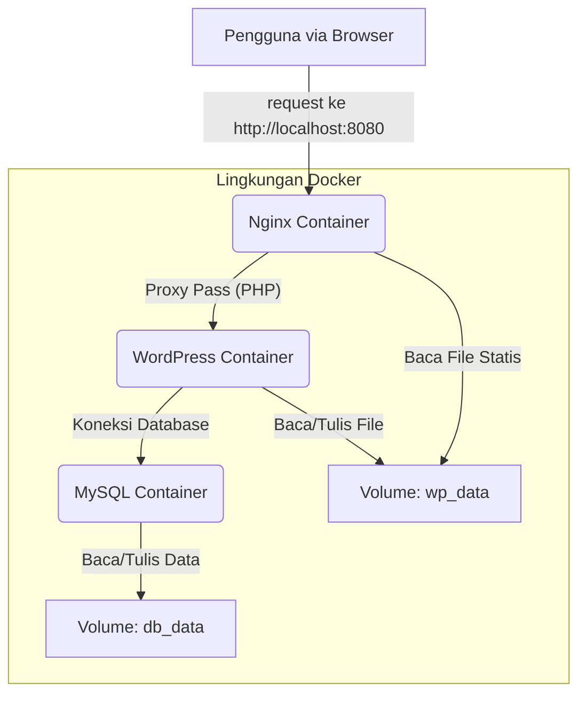

# WordPress Docker Setup 🐳

Proyek ini menyediakan satu set skrip untuk secara otomatis membuat lingkungan pengembangan WordPress lokal yang lengkap menggunakan Docker. Lingkungan ini terdiri dari Nginx sebagai web server, WordPress dengan PHP-FPM, dan database MySQL, yang semuanya berjalan dalam container yang terisolasi.

Tujuan utama dari proyek ini adalah menyediakan cara yang cepat, bersih, dan dapat diulang untuk memulai proyek WordPress tanpa perlu menginstal PHP, Nginx, atau MySQL secara global di komputer Anda.

### Fitur Utama

  * **Setup Otomatis**: Cukup jalankan satu skrip untuk membangun seluruh lingkungan dari awal.
  * **Lingkungan Terisolasi**: Semua layanan berjalan di dalam container Docker, tidak "mengotori" sistem Mac Anda.
  * **Pembersihan Mudah**: Hapus seluruh lingkungan, termasuk volume database, hanya dengan satu perintah.
  * **Portabel & Konsisten**: Mudah dibagikan dan akan berjalan dengan cara yang sama di mesin lain yang memiliki Docker.

-----

## Cara Penggunaan

Pastikan Anda sudah menginstal **Docker Desktop for Mac** dan dalam keadaan berjalan.

**1. Clone Repositori**
Buka iTerm dan jalankan perintah berikut untuk mengunduh proyek ini ke komputer Anda:

```bash
git clone https://github.com/adiwp/wordpress-docker-setup.git
```

**2. Masuk ke Direktori Proyek**

```bash
cd wordpress-docker-setup
```

**3. Berikan Izin Eksekusi pada Skrip**
Anda hanya perlu melakukan ini sekali.

```bash
chmod +x setup.sh cleanup.sh
```

**4. Jalankan Setup**
Skrip ini akan memulai seluruh proses, termasuk meminta password database Anda.

```bash
./setup.sh
```

**5. Akses Situs WordPress Anda**
Setelah proses setup selesai, buka browser Anda dan kunjungi:
**`http://localhost:8080`**

Anda akan disambut oleh halaman instalasi WordPress.

**6. Membersihkan Lingkungan**
Jika Anda ingin menghapus semua container, network, dan volume data, jalankan skrip cleanup.

```bash
./cleanup.sh
```

-----

## Penjelasan File

Berikut adalah penjelasan untuk setiap file konfigurasi utama dalam proyek ini:

#### `setup.sh`

Ini adalah skrip utama untuk otomasi. Saat dijalankan, skrip ini akan melakukan beberapa hal secara berurutan:

1.  Meminta input pengguna untuk password database yang aman.
2.  **Membuat file `docker-compose.yml`** secara dinamis dengan password yang telah diinput.
3.  Membuat direktori `nginx/` dan **membuat file `default.conf`** di dalamnya.
4.  Menjalankan perintah `docker compose up -d` untuk membangun dan memulai semua container di background.

#### `cleanup.sh`

Skrip ini adalah kebalikan dari `setup.sh`. Tugasnya adalah membersihkan lingkungan kerja Anda secara total:

1.  Menjalankan `docker compose down -v` untuk menghentikan semua container dan **menghapus volume data** (ini akan menghapus database dan file upload Anda).
2.  Menghapus file `docker-compose.yml` dan direktori `nginx/` yang sebelumnya dibuat oleh `setup.sh`.

#### `docker-compose.yml`

Ini adalah *blueprint* atau "master plan" untuk Docker Compose. File ini mendefinisikan semua layanan yang dibutuhkan aplikasi kita:

  * **`db`**: Layanan untuk database MySQL, lengkap dengan `healthcheck` untuk memastikan database siap sebelum WordPress berjalan.
  * **`wordpress`**: Layanan untuk aplikasi WordPress, menggunakan image `fpm-alpine` yang ringan dan dirancang untuk Nginx.
  * **`nginx`**: Layanan untuk web server Nginx, yang bertindak sebagai pintu masuk untuk semua trafik web.

> **Catatan**: File `docker-compose.yml` di repositori ini adalah contoh. File yang sebenarnya digunakan akan dibuat ulang oleh `setup.sh` setiap kali dijalankan.

#### `default.conf`

Ini adalah file konfigurasi untuk Nginx. Di dalamnya, kita mendefinisikan bagaimana Nginx harus menangani permintaan yang masuk:

  * Mengatur `root` direktori ke `/var/www/html`.
  * Meneruskan semua permintaan untuk file `.php` ke layanan `wordpress` (PHP-FPM) di port 9000.
  * Menangani URL *permalink* WordPress dengan benar.

> **Catatan**: Sama seperti `docker-compose.yml`, file ini juga dibuat secara otomatis oleh `setup.sh` di dalam folder `nginx/`.

#### `.gitignore`

File ini adalah file standar Git yang memberitahunya untuk mengabaikan file atau folder tertentu. Dalam kasus ini, ia digunakan untuk mengabaikan file sistem macOS (`.DS_Store`) agar tidak masuk ke repositori.

-----

## Arsitektur


